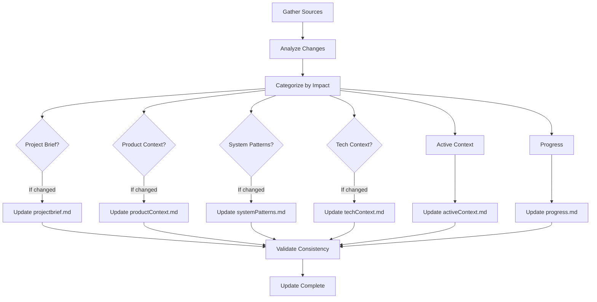

# Update Memory Bank

This task updates the Memory Bank documentation based on recent project activities. The Memory Bank ensures AI agents maintain context across sessions by preserving project knowledge in structured files.

## Purpose

Update the Memory Bank to reflect:
- Recent development activities and decisions
- Architectural changes and patterns
- Technical context updates
- Progress and current work state
- Lessons learned and insights

## Data Sources

The update draws from multiple sources:
- **Dev Journal Entries**: Daily development narratives in `docs/devJournal/`
- **CHANGELOG.md**: Recent changes and version history
- **README Files**: Project documentation updates
- **ADRs**: Architectural Decision Records in `docs/adr/`
- **Source Code**: Actual implementation changes
- **Test Results**: Quality and coverage updates

## Update Process

### 1. Gather Recent Changes

```bash
# Review dev journals from recent sessions
ls -la docs/devJournal/*.md | tail -5

# Check recent ADRs
ls -la docs/adr/*.md | tail -5

# Review CHANGELOG
head -50 CHANGELOG.md

# Check README updates
find . -name "README*.md" -mtime -7
```

### 2. Analyze Impact

For each source, identify:
- What changed and why
- Impact on system architecture
- New patterns or conventions
- Technical decisions made
- Open questions resolved
- New dependencies or constraints

### 3. Update Memory Bank Files

Update relevant files based on changes:

#### 3.1 Project Brief (`projectbrief.md`)
Update if:
- Core requirements changed
- Project goals refined
- Success criteria modified
- New constraints identified

#### 3.2 Product Context (`productContext.md`)
Update if:
- User needs clarified
- Problem understanding evolved
- Expected outcomes changed
- UX goals modified

#### 3.3 System Patterns (`systemPatterns.md`)
Update if:
- Architecture decisions made (check ADRs)
- New design patterns adopted
- Component relationships changed
- Integration points modified
- Critical paths identified

#### 3.4 Tech Context (`techContext.md`)
Update if:
- Dependencies added/updated
- Tools or frameworks changed
- Build process modified
- Technical constraints discovered
- Environment changes

#### 3.5 Active Context (`activeContext.md`)
ALWAYS update with:
- Current work items
- Recent completions
- Active decisions
- Next priorities
- Open questions
- Important patterns discovered
- Learnings from dev journals

#### 3.6 Progress (`progress.md`)
Update with:
- Features completed
- Work in progress status
- Issues discovered/resolved
- Technical debt changes
- Decision evolution

### 4. Validation

After updates:
1. **Cross-Reference Check**: Ensure consistency across all files
2. **Accuracy Verification**: Confirm updates match source material
3. **Completeness Review**: No critical information omitted
4. **Clarity Assessment**: Clear for future AI sessions

### 5. Update Guidelines

- **Be Concise**: Capture essence without excessive detail
- **Be Comprehensive**: Include all significant changes
- **Be Accurate**: Reflect actual state, not aspirations
- **Maintain Consistency**: Align with existing memory bank content
- **Use British English**: For consistency across documentation

## Selective vs Comprehensive Updates

### Selective Update
Triggered by specific events:
- Story completion → Update progress and activeContext
- ADR creation → Update systemPatterns
- Major decision → Update relevant sections
- Architecture change → Update systemPatterns and techContext

### Comprehensive Update
Triggered by:
- End of sprint/iteration
- Major milestone reached
- Explicit user request
- Significant project pivot
- Before major feature work

## Quality Checklist

- [ ] All recent dev journals reviewed
- [ ] ADRs incorporated into systemPatterns
- [ ] CHANGELOG reflected in progress
- [ ] Active work items current
- [ ] Technical decisions documented
- [ ] No contradictions between files
- [ ] Next steps clearly defined
- [ ] British English used throughout

## Integration Points

This task integrates with:
- **Dev Journal Creation**: Triggers selective activeContext update
- **ADR Creation**: Triggers systemPatterns update
- **Story Completion**: Triggers progress update
- **Sprint End**: Triggers comprehensive update
- **Architecture Changes**: Triggers multiple file updates

## Example Update Flow



## Notes

- Memory Bank is critical for AI session continuity
- Updates should capture reality, not ideals
- Focus on information that helps future sessions
- Balance detail with conciseness
- Remember: This is the AI's only link to past work after memory reset